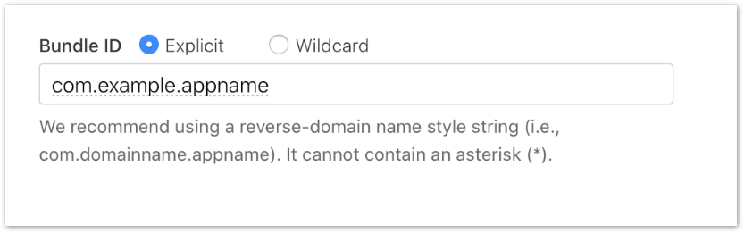
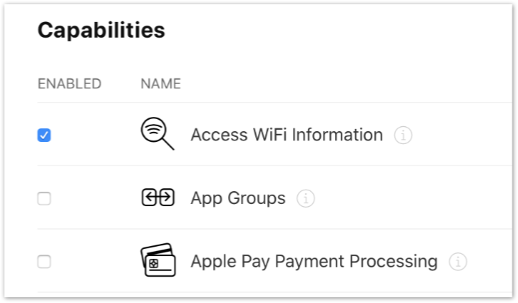
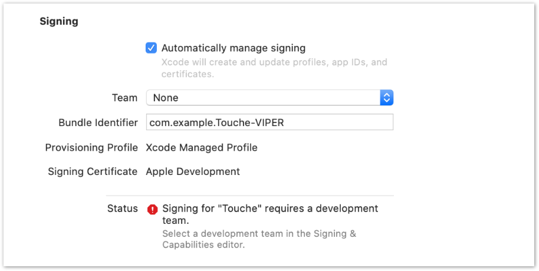
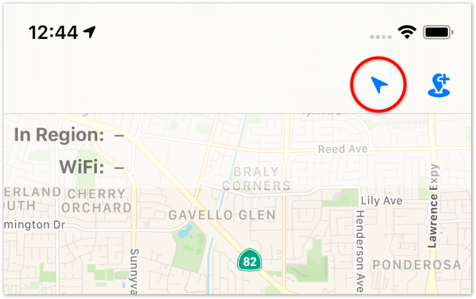
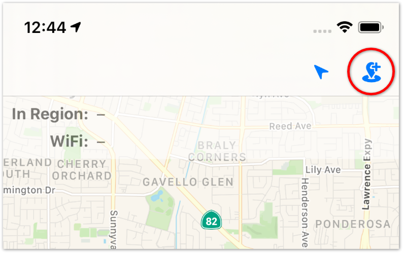
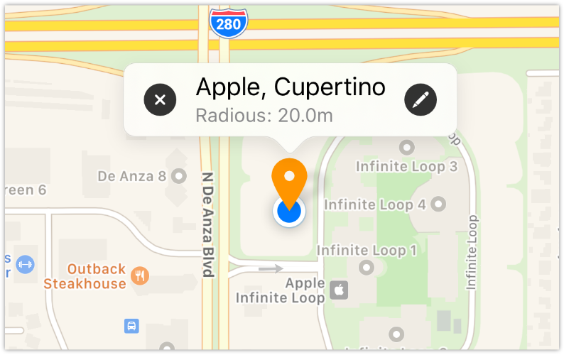
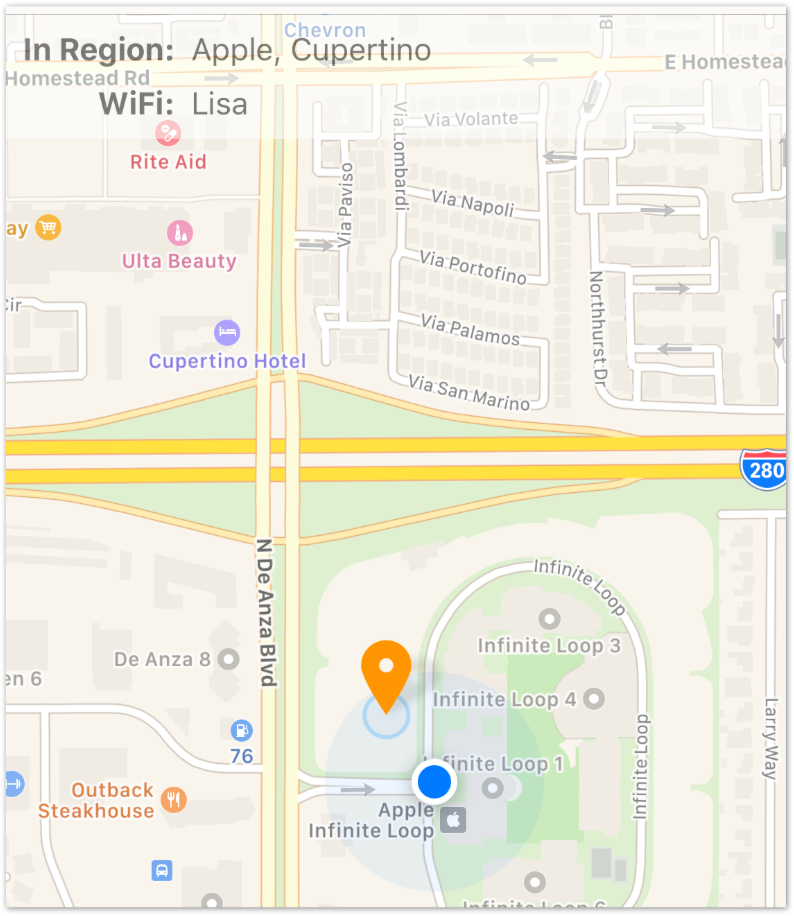

# Touché

*GPS and WiFi location geofencing demo app developed using VIPER architecture*

* **Version**: 1.0
* **Platform**: iPhone Only
* **OS Version**: iOS 13.2 and above
* **Xcode Version**: Xcode 11.3.1
* **Swift Version**: 5.1.3

## How to Run Touché on Your iPhone

In order to run Touché from Xcode to a connected iPhone, there are
prerequisite need to be fulfilled.

* Access WiFi information
* Apple Developer Account
* Code Signing certificates.

*Note: The instruction that follows relates only to setting up the
 Touché project with the assumption you have a developer account and
 is well-versed in setting up Xcode for your Apple Developer Account
 and Code Signing certificates.*

### Entitlement Setup

Touché requires the *Access WiFi information* entitlement to be able
to run on your iPhone. Without the entitlement for accessing WiFi
information, Touché will not be able to function. Follow the
instructions below to setup the entitlement.

*Note: Touché requires a physical iPhone to fully function. Even though
 the entitlement has been setup up correctly, Touché still will not
 function well in the iPhone simulator.* 

#### Apple Developer Account

The *Access WiFi information* entitlement file in the Touché project
is already setup but it requires the counterpart setting on the
[Apple Developer Portal](https://developer.apple.com) to function. The
*Access WiFi information* capabilities setting is configured under
*App ID* and in order to create an *App ID*, **you will need a paying
developer account** with Apple because *Personal Team* accounts are not
allowed to create *App ID*.

#### App ID

Create an *App ID* on the Apple Developer Portal with **explicit** Bundle
ID. Wildcard Bundle ID are not allowed to add capabilities. Bundle IDs
are globally unique so any unique ID is acceptable.

#### Capabilities Setup

During the creation of the *App ID*, select the *Access WiFi
information* capabilities which is the first on the list of
Capabilities section. If you did not select the capabilities during
the creation of the *App ID*, you can go back into the *App ID*
section anytime to add the capabilities. Remember to save the new *App
ID* configuration after you’re done. 

### Code Sign Setup

1. Select **Touché** project on the *Project Navigator*.
1. Select **Touché** target on the *Targets* section.
1. Select **Signing & Capabilities** tab on the tab bar.
1. Select your **Apple Developer Account** from the Team dropdown
   (Sign in if you have not done so). 
1. Enter the **Bundle ID** you’ve created into the *Bundle Identifier*
   field. This is the *App ID* you’ve created when you setup the Capabilities.

## How to Use Touché

After setting up the project, you can run Touché from Xcode onto an iPhone.

### Location Data Permission

The first time Touché is launched, it’ll request user’s permission to
access location function required for Touché to run. Tap *Allow While
Using App* to grant the permission. Without the user location access,
Touché will not be able to function as designed.

### Center Map Quickly at the User Location

Tap on the *GPS* button to center map at your location.

### Add and Configure Geofence

1. Tap on the *Add Geofence* button on the top right corner.
1. Fill in the geofence name and the associated WiFi name.
1. Review the radius (in meter) and change as appropriate.
1. Tap the `Add` button near the top right to complete adding
   geofence.

*Note: The `Add` button will not be enabled if any of the fields are
 left empty.*

### About Geofence

* *Geofence area is*:
  *  Physically constrained by a circular area that is defined with a
     point in the center and the radius from the center point to the
     circumference.
  *  Connection to a specific WiFi network name associated with a physical
     circular area.

* *A device is deemed to be within a geofence when*:
  *  The device is physically in the circular area as reported by the
     device GPS coordinates.
  *  The device is connected to associated WiFi network (identified by
     the WiFi Network Name and case sensitive) even though the device
     GPS reports the device current coordinates are physically outside
     of the associated circle.

### Removing and Editing Geofences

* *Removing geofence*:
  1. Tap on the `Map Pin` to review the info callout.
  1. Tap on the `X` button on the left side of the callout to remove.

* *Edit geofence*:
  1. Tap on the `Map Pin` to review the info callout.
  1. Tap on the `Pencil` button on the right side of the callout to
  edit.
  1. SSID, location name, radius and the location of the pin are
     editable. To change the location of the pin, drag and pan the map
     to the desirable location.

### Geofence Information Panel

Located on the top right below the navigation bar, the Geofence
Information Panel changes in real time to show the user’s location in
one of the configured geofence area or not in any geofence area at
all. Below the geofence info is the currently connected WiFi network
name.

#### Geofence Name

The Geofence Name is the name given when adding the geofence. The
iPhone is not within any geofence area if the geofence name is `"–"`.

#### Connected WiFi Name

The name of the currently connected WiFi. **Note**: When the
WiFi name is `"–"` it means the user’s iPhone is not connected to any
WiFi. There may be situation where the users iPhone is within a
geofence area but connected to a WiFi network that is not associated
with the geofence.

## License

> Released under MIT license.
>
> Copyright (c) 2020 WeyHan Ng
>
> Permission is hereby granted, free of charge, to any person obtaining a copy
> of this software and associated documentation files (the "Software"), to deal
> in the Software without restriction, including without limitation the rights
> to use, copy, modify, merge, publish, distribute, sublicense, and/or sell
> copies of the Software, and to permit persons to whom the Software is
> furnished to do so, subject to the following conditions:
>
> The above copyright notice and this permission notice shall be included in
> all copies or substantial portions of the Software.
>
> THE SOFTWARE IS PROVIDED "AS IS", WITHOUT WARRANTY OF ANY KIND, EXPRESS OR
> IMPLIED, INCLUDING BUT NOT LIMITED TO THE WARRANTIES OF MERCHANTABILITY,
> FITNESS FOR A PARTICULAR PURPOSE AND NONINFRINGEMENT. IN NO EVENT SHALL THE
> AUTHORS OR COPYRIGHT HOLDERS BE LIABLE FOR ANY CLAIM, DAMAGES OR OTHER
> LIABILITY, WHETHER IN AN ACTION OF CONTRACT, TORT OR OTHERWISE, ARISING FROM,
> OUT OF OR IN CONNECTION WITH THE SOFTWARE OR THE USE OR OTHER DEALINGS IN
> THE SOFTWARE.
